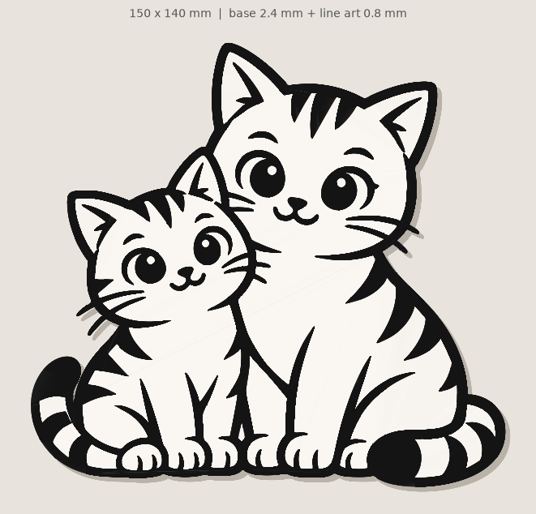
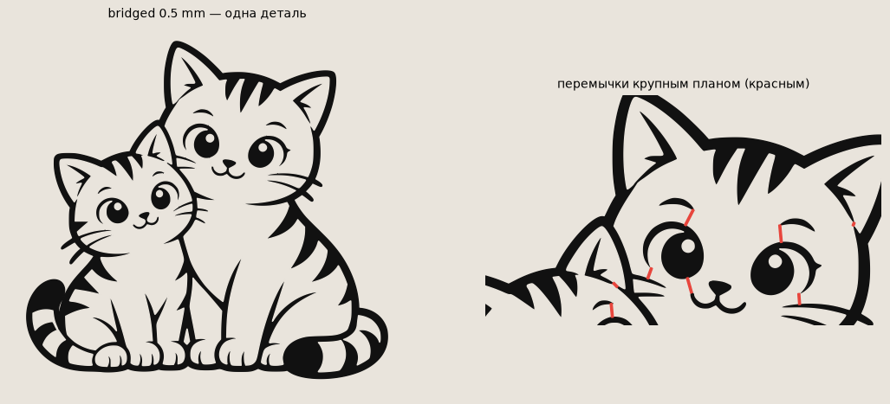
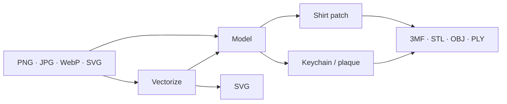

<div align="center">

# picture to print

**A drawing goes in. A model you can actually print comes out.**

Trace a picture into clean curves, then turn it into a TPU shirt patch
or a two-color keychain. The preview is the mesh.

<p>
  
  
  
  
</p>



<sub>Sample plaque · 150 × 140 mm · base 2.4 mm + line art 0.8 mm</sub>

</div>

---

Drop a PNG, JPG, WebP, BMP, or an SVG that already has fills. The app
traces the ink into Bézier curves, builds a solid from the same geometry
you see on screen, and hands you a file a slicer can open.

Nothing is uploaded. The picture stays in the process that is serving
the page.

## Two things it makes

<table>
<tr>
<td width="50%" valign="top">

### Shirt patch

A flat part made only from the black.
Print it in TPU, one or two layers, and iron it onto a shirt.

Separate islands can be tied together with bridges so the patch
comes off the bed as one piece.

</td>
<td width="50%" valign="top">

### Keychain or plaque

A silhouette base, plus the drawing raised on top.
Two objects, already aligned, for a two-color print.

Or fuse them and print one color, with the drawing as relief.

</td>
</tr>
</table>

<p align="center">
  
  <br>
  <sub>One bridged patch. The red marks are the bridges, shown large on the right.</sub>
</p>

## Run it

**macOS, from Finder.** Double-click `Run.command`, or
`lineart2print.app` (that one can live in the Dock). The first launch
creates `.venv` and installs dependencies. The browser opens at
[http://127.0.0.1:8765](http://127.0.0.1:8765). Close the terminal
window and the server goes with it. A second click, while it is
already up, only opens the tab.

The `.app` has to sit next to `Run.command`. Move the app alone
and it will say so.

**Terminal** (macOS or Linux).

```bash
./run.sh
```

**Windows.**

```bat
python -m venv .venv
.venv\Scripts\pip install -r app\requirements.txt
.venv\Scripts\python -m uvicorn server:app --app-dir app --host 127.0.0.1 --port 8765
```

Then open [http://127.0.0.1:8765](http://127.0.0.1:8765).

**Docker.**

```bash
docker build -t picture-to-print .
docker run --rm -p 8765:8765 picture-to-print
```

Keep `--workers 1`. The in-process queue assumes a single uvicorn process.

## What you can do with a picture



**Vectorize** is the clean path. Black-and-white tracing, or a color
reduction down to a handful of swatches you can recolor, hide, or
sample with an eyedropper. Blur before the threshold when a JPEG is
noisy. Smoothing runs from hard corners to soft curves. Specks can be
dropped, curves simplified, and a low-resolution image enlarged before
the trace. Click islands to keep a shape or throw it out. The overlay
shows the vector on top of the original, so you can see where the
contour left the picture.

**Send to model** keeps the original on the vector tab. Tune the trace
and send it again.

A raster can skip tracing and go straight to the model. That contour
follows pixels and comes out jagged. Use it when you do not care.

## Knobs that matter at the printer

| | |
|---|---|
| Size | Width or height, 10–300 mm |
| Strokes | Thicken thin tips. Simplify the contour so the 3MF stays small |
| Nozzle | 0.2–0.8 mm. The preview flags anything narrower than the nozzle |
| Mirror | Flip along X before you export |
| Patch | Thickness, bridges and their width, and how far the plastic spreads when you iron it |
| Plaque | Base thickness, relief height, silhouette or rounded rectangle, margin, corner radius, drop tiny islands |
| Hole | Diameter, rim, and an X/Y position. Park it outside the silhouette and a tab grows out to meet the part |
| Export | 3MF keeps both objects aligned. STL, OBJ, and PLY are there too. A plaque can be base only, drawing only, or fused into one color |

Under the preview: size, height, how many separate pieces, bridges,
area, volume, TPU weight, and the share of the area thinner than the
nozzle. Warnings sit in the same place.

Undo and redo cover the edits. The interface is Arabic, Chinese,
English, French, Russian, and Spanish.

## What stays on the machine

The server writes nothing to disk. Source bytes and parsed contours
live in memory until you delete the job or it sits idle for 10 minutes.
Heavy work (preview, export, vectorize) waits in a queue of two
workers, with at most 30 jobs waiting. That limit is real only with
one uvicorn process.

```bash
pip install -r requirements-dev.txt
python -m pytest
```

`pytest` stays out of `app/requirements.txt`. The suite checks clamps,
the queue, job expiry, and SVG headers.

## Layout

```
Run.command           double-click launch, creates .venv the first time
lineart2print.app     Dock wrapper, looks for Run.command beside it
run.sh                terminal launch
Dockerfile            python:3.12-slim, port 8765
app/core.py           contours, holes, bridges, extrude, STL/3MF/OBJ/PLY
app/vectorize.py      raster to SVG through potrace
app/server.py         FastAPI
app/static/           the page, no build step
app/requirements.txt  runtime dependencies
requirements-dev.txt  runtime plus pytest
```

<details>
<summary>По-русски</summary>

Веб-приложение из двух вкладок. **Векторизация** превращает PNG/JPG в
чистый SVG кривыми Безье. **Модель** делает из контура деталь для
печати.

**Нашивка** — плоская деталь только из чёрного. Печатается TPU в 1–2
слоя и переносится на ткань утюгом. Отдельные куски можно связать
перемычками.

**Брелок / панно** — подложка-силуэт и рисунок рельефом сверху, два
объекта для печати в два цвета. Можно скачать только подложку, только
рисунок или склеить в одну деталь.

Запуск на macOS — двойной клик по `Run.command` или
`lineart2print.app`. Из терминала — `./run.sh`. Браузер откроется на
<http://127.0.0.1:8765>.

Габарит задаётся по ширине или высоте. Есть зеркало по X, утолщение
штрихов, упрощение контура, предупреждение о линиях тоньше сопла,
отверстие для подвеса (если вынести его за силуэт, вырастет ушко).
Превью строится из той же геометрии, что уходит в меш. На диск сервер
ничего не пишет: задача живёт в памяти и удаляется после 10 минут
простоя.

</details>

## License

[MIT](LICENSE).
